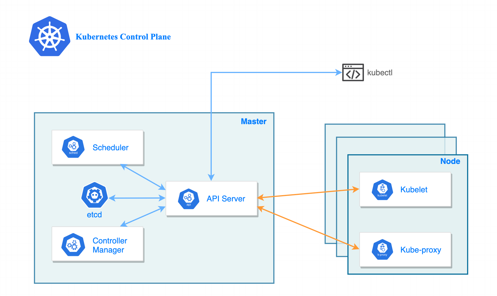

# Kubernetes-daily-practices
# 🚀 Kubernetes Daily Practice

# 📌 Overview

Today I practiced the fundamentals of Kubernetes by setting up a local cluster using kind and deploying applications using YAML manifests. This project covers Kubernetes architecture, basic commands, and core resources like Pods, Deployments, Services, and Namespaces.

---

# 🧠 Kubernetes Architecture

Kubernetes follows a **master-worker architecture**:



# 🔹 Control Plane (Master)

* API Server
* Scheduler
* Controller Manager
* etcd

# 🔹 Worker Nodes

* Kubelet
* Server-proxy
* Pods (running application)

---

# ⚙️ Tools Used

* Kubernetes
* kind (Kubernetes IN Docker)
* kubectl
* Docker

---

# 🛠️ Setup Steps

# 1️⃣ Install kind

```bash
curl -Lo ./kind https://kind.sigs.k8s.io/dl/latest/kind-linux-amd64
chmod +x ./kind
sudo mv ./kind /usr/local/bin/kind
```

# 2️⃣ Create Cluster

```bash
kind create cluster --name apurv-cluster
```

# 3️⃣ Verify Cluster

```bash
kubectl get nodes
kubectl cluster-info
```

---

# 📄 Kubernetes YAML Basics

# Structure:

```yaml
apiVersion:
kind:
metadata:
spec:
```

# Example:

```yaml
apiVersion: v1
kind: Pod
metadata:
  name: nginx
spec:
  containers:
    - name: nginx
      image: nginx
```

---

# 🔥 Basic Commands Used

```bash
kubectl get pods
kubectl get svc
kubectl get deployment
kubectl describe pod <name>
kubectl logs <pod-name>

kubectl apply -f <file>
kubectl delete -f <file>

kubectl scale deployment flask-deployment --replicas=10 -n flask-app
```
---

# 💡 Key Learnings

* Kubernetes works on **desired state**
* YAML is used to define infrastructure
* Deployment manages replicas
* Service provides stable networking
* Namespace provides isolation
* NodePort helps expose applications externally

---

# 🚀 Conclusion

This practice helped me understand Kubernetes fundamentals including cluster setup, resource creation, networking, and scaling. This forms the base for advanced topics like Ingress, CI/CD, and cloud deployments.

----
